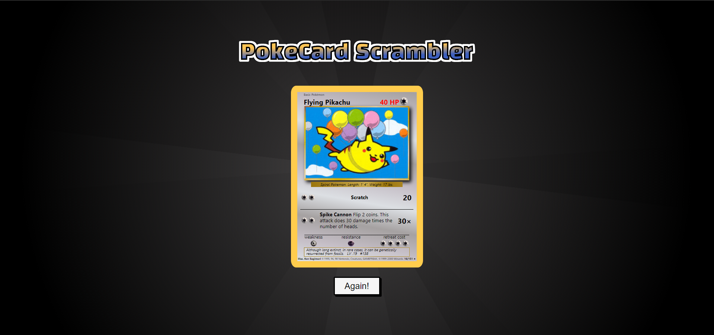

This project was bootstrapped with [Create React App](https://github.com/facebook/create-react-app).

## PokéCard Scrambler

A single-page app that makes use of the excellent [Pokémon TCG Developers API](https://pokemontcg.io/)
to allow random generation of new Pokémon cards by recombining assets of other cards.

### Current Functionality

Parts of each generated card that are kept from the basis card:  

- Pokémon name
- Stage and evolution text
- Stage and evolution thumbnail
- Portrait

Parts of each generated card that are fetched from other cards and appended onto the basis card:  

- Attack 1, from a second card: Energy cost, text, and damage
- Attack 2, from a third card: Energy cost, text, and damage

Parts of each generated card that are scrambled from a limited list of choices:  

- Card Type (of 9 choices)
- Hit Points value (from 30 - 120)
- Weakness (of 9 choices)
- Resistance (of 9 choices)
- Retreat Cost (from 0 - 4)

Only the first two series of the TCG, Base and Neo (circa 1999-2002), are included, because card layout shifted dramatically after that.

Certain outlier cards like Rocket's Mewtwo (Gym Challenge 14), Elekid (Neo Genesis 22), and Igglybuff (Neo Discovery 40), are also excluded because they do not fit with the template.

Pokémon height, weight, and Pokédex entry are not generated dynamically, because they are not offered by the Pokémon TCG Developers API. Instead, every card uses the height, weight, and Pokédex entry of Omanyte (Fossil 52), because I like it.

## Local Installation

Simply clone the repository to your computer, then in its root directory run `npm install` and then `npm start`. It should be running on localhost:3000
